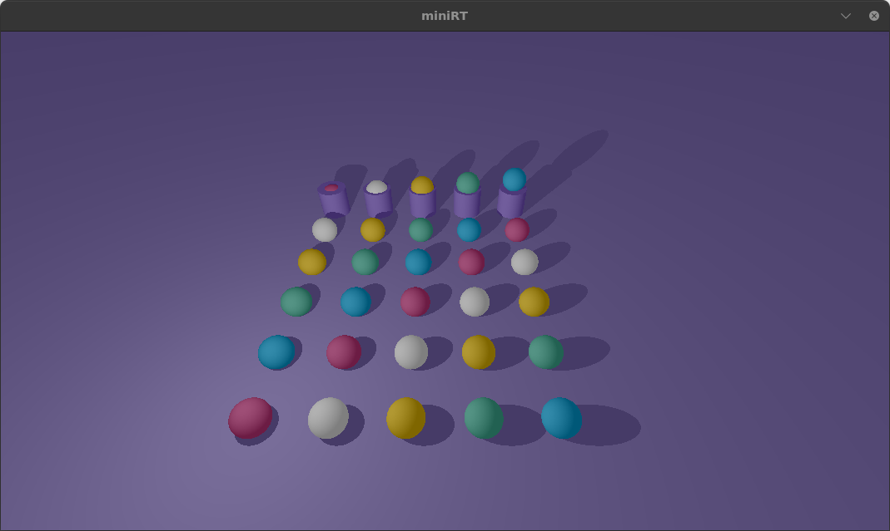
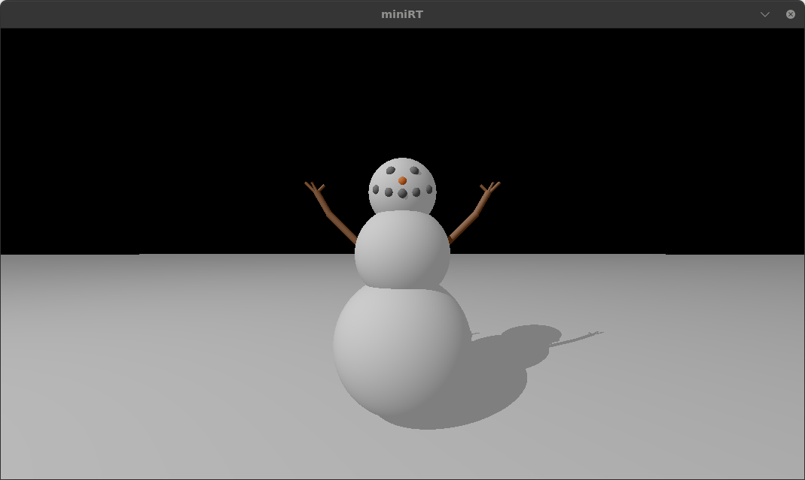
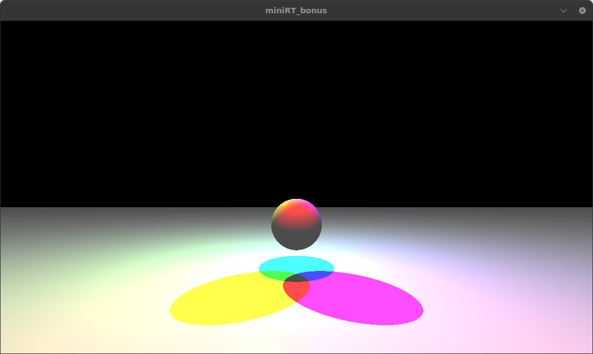
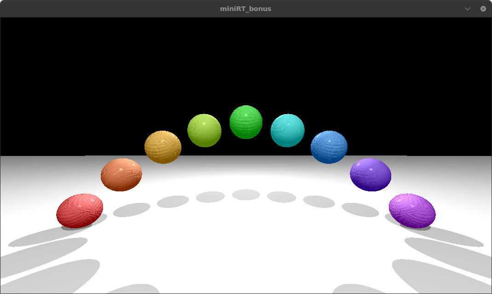
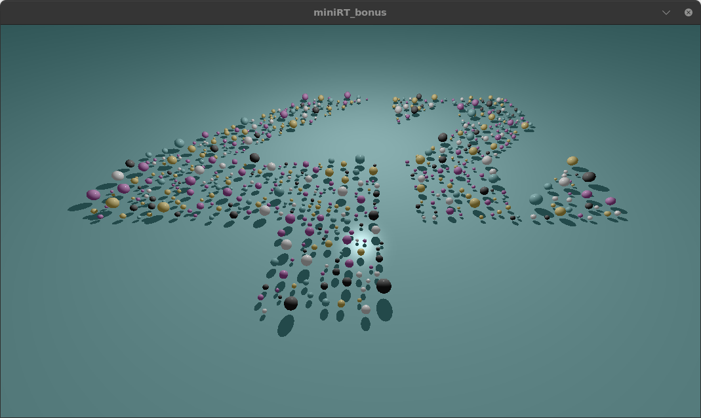

# 42SP_miniRT
A simple implementation of a ray tracer

# miniRT

## Description
The goal of this project is to implement a simple ray tracer from scratch in C.

It renders basic 3D objects (planes, spheres and cylinders) while managing light sources, shadows and ambient and difuse lighting.

The program must be executed with a .rt file as an argument. This file contains informations about the scene and all the elements to be rendered.

For example:

Ambient light

A   0.5                       255,255,255

Camera

C   0,0,8    0,0,-1           100

Light

L   0,4,4    0.4

Sphere

sp  0,0,0    8                216,56,136

More informations can be found in the directory "scenes/file_models".

## Summary
- [Features](#features)
- [Installation](#installation)
- [Usage](#usage)
- [Examples](#examples)

## Features
- **Bonus:**
    - Add specular reflections using the Phong lighting model
    - Implement a checkerboard pattern
    - Add colored and multi-spot light sources
    - Add one more second degree object (cone, hyperboloid, paraboloid)
    - Handle bump textures

## Installation

This project depends on the **MLX42** graphics library, which requires the following dependencies:

### In Linux (Debian / Ubuntu)

1. Install the required packages:
   ```bash
   sudo apt update
   sudo apt install build-essential libx11-dev libglfw3-dev libglfw3 xorg-dev cmake

2. Clone the project and compile MLX42:
	```bash
	git clone https://github.com/juncaroline/42SP_miniRT.git
	cd 42SP_miniRT/library/MLX42
	cmake -B build
	cmake --build build
	sudo cmake --install build

## Usage
To compile the project:

	make bonus
 
To visualize the project:

	./miniRT_bonus scenes/bonus/10_42.rt 

## Examples





